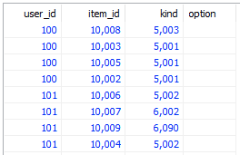

# DB 개요

## 소개
실버바인 서버 엔진 2는 주 데이터 저장소로 MariaDB를 사용합니다. 그러나 게임 프로그래머가 SQL 쿼리를 직접 작성할 필요는 없습니다(사실 불가능합니다). 대신 엔진에서 제공하는 API를 활용해서 데이터 읽고쓰기 코드를 만들면 됩니다.
 
엔진의 데이터 모델과 읽고쓰기 API는 마비노기 듀얼을 만들었던 경험을 토대로 정리한 것으로, 게임 데이터는 대부분 유저별로 변화한다는 가정에 기초하고 있습니다. 따라서 한 유저에게 속한 데이터를 변경하는 게임 코드를 가능한 한 간결하고 직관적으로 표현할 수 있도록 설계했습니다.
 
실버바인 서버 엔진 2의 데이터는 크게 두 가지로 구분할 수 있습니다. 도큐먼트와 글로벌 테이블입니다.

## 도큐먼트

타입|키|정렬|비고
-|-|-|-
SingularTable|X|X|하나의 행만 가질 수 있음
PluralTable|X|X|O
PluralTableWithKey|O|X|키로 조회 가능
DequeTable|X|O|양쪽 끝에서 삽입과 삭제가 모두 가능
 
도큐먼트는 유저별 데이터를 저장하기 위해 만들어졌습니다. 유저 한 명당 하나의 도큐먼트를 만들고, 도큐먼트 id를 그대로 유저 id로 사용하고, 해당 유저에 속하는 데이터를 전부 그 도큐먼트에 저장합니다. 유저와 1:1 관계가 아니더라도, 유저 수에 비례해서 존재할 데이터도 도큐먼트로 모델링하면 좋습니다. 길드/클랜이 대표적인 예가 되겠습니다.
 
MMORPG 아이템 인벤토리를 어떻게 저장할지 상상해 봅시다. 아이템 하나하나를 RDBMS에 저장한다면 대략 다음과 같은 테이블이 필요할 것입니다.

 
각 행에 user_id 를 적음으로써 아이템이 어느 유저의 소유인지를 나타냅니다.
 
실버바인 서버 엔진 2의 유저별 데이터 모델링 방법도 이와 비슷한데, 조금 다릅니다. 테이블이 전역적으로 존재하는 것이 아니라, 도큐먼트별로 존재합니다. 위의 예제로 설명하자면, 아이템 하나를 RDBMS 테이블에서 읽으려면 &lt;`user_id`, `item_id`> 로 조회하거나 혹은 `item_id` 로 바로 조회할 수 있는 반면, 실버바인 서버 엔진 2에서는 먼저 `user_id` 로 도큐먼트를 열고 나서 `item_id` 로 조회해야 합니다.
 
도큐먼트는 여러 종류의 테이블을 가질 수 있습니다. 어떤 종류의 도큐먼트가 있는지, 각 도큐먼트들이 어떤 종류의 테이블을 가질 수 있는지, 각 테이블이 어떤 컬럼을 갖고 있는지를 데이터 스키마 정의 파일에 기술하고 빌드하면 데이터에 접근하는 코드가 자동 생성됩니다.
 
테이블은 행을 최대 1개까지만 갖도록(`singular`) 설정할 수도 있습니다. 유저의 게임 머니나 경험치, 레벨 등을 저장하려면 이런 테이블을 이용하는 것이 편리할 것입니다.
 
도큐먼트별 테이블은 키 컬럼을 하나 갖도록 설정할 수 있습니다. 키 컬럼을 갖는 테이블에서는 키를 가지고 행을 바로 조회할 수 있고, 키 컬럼의 값들은 그 도큐먼트의 테이블 안에서 유일함이 보장됩니다.
 
도큐먼트는 자동발급된 `int64` 값으로만 식별할 수 있습니다. 따라서, 도큐먼트를 id 이외의 다른 방법으로 찾으려면 글로벌 테이블을 함께 이용해야 합니다. 외부 계정 식별자로부터 유저 id를 찾는 과정이 대표적인 예가 되겠습니다. 글로벌 테이블에 외부 계정 식별자를 키로 하고, 컬럼 중 하나에 도큐먼트 id를 저장하면 됩니다.   

도큐먼트별 테이블은 양쪽 끝에서 삽입과 삭제가 가능하도록(deque)을 설정할 수 있습니다. 이 경우 데이터는 삽입한 순서대로 정렬이 유지됩니다.
 

## 글로벌 테이블

타입|키|정렬|비고
-|-|-|-
GlobalTable|O|X|반드시 Key로 조회 해야 함
OrderedGlobalTable|O|O|점수로 순위를 정렬 함

 
도큐먼트 테이블로 만들기 곤란한 데이터는 글로벌 테이블에 넣으면 됩니다. 행의 개수가 너무 많거나 접근이 너무 빈번해서 성능 문제가 예상되는 경우, 개념적으로 특정 도큐먼트에 속하지 않는 경우, 도큐먼트를 찾기 위한 인덱스로 활용하기 위한 경우 글로벌 테이블을 사용합니다.
 
글로벌 테이블은 도큐먼트 테이블과 다르게 반드시 키를 가져야만 하고, 테이블 전체를 한꺼번에 조회할 수 없습니다.

글로벌 테이블은 점수로 순위가 정렬하도록(Ordered) 정의할 수 있습니다. 정렬된 글로벌 테이블의 Key는 Redis StoredSet을 사용하여 저장됩니다.

## 데이터 스키마

어떤 종류의 글로벌 테이블이 있는지, 어떤 종류의 도큐먼트가 있으며 그 안에는 어떤 종류의 도큐먼트 테이블들이 있는지, 각 테이블을 이루는 행에는 어떤 필드가 저장되는지를 `.schema` 파일에서 정의합니다.

## 데이터베이스 메타데이터
게임서버에서 데이터 스키마로 정의한 정보는 컴파일시 코드생성기를 통하여 데이터베이스 메타데이터(DatabaseMetadataForServer) 소스코드로 생성됩니다. 

데이터베이스 메타데이터는 게임서버 초기화 시 엔진 내부로 전달하고, 각 테이블의 TypeId 확인이나 트랜잭션(Lock) 처리에서 사용하게 됩니다.