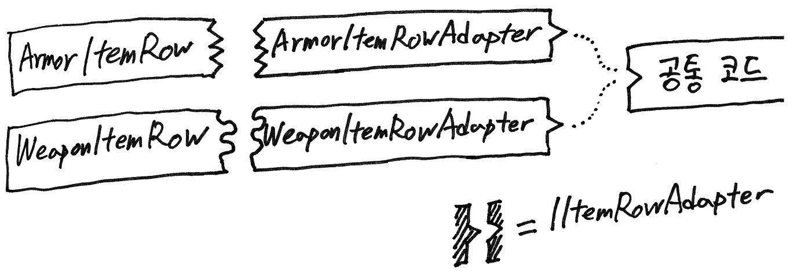

# 자동 생성된 Row 클래스를 공통 인터페이스로 묶기

다형 객체를 데이터베이스에 저장하고 싶을 때가 있습니다.

RPG에서 흔히 볼 법한 상황을 예제로 들어보겠습니다.
```csharp
class WeaponItemRow : IItemRow { ... }
class ArmorItemRow : IItemRow { ... }
```
무기 아이템과 방어구 아이템이 공통으로 갖는 필드가 있고
아이템들의 공통 필드에만 관심을 갖는 코드가 있을 때,
클래스를 이런 식으로 만들고 싶을 것입니다.
그런데 실버바인 서버 엔진 2에서는 이런 기능을 제공하지 않습니다.

그럼 이런 코드를 어떻게 만들면 좋을까요?

아래 그림과 같이, 자동 생성되는 Row 클래스별로 어댑터 클래스를 만들고,
어댑터 클래스가 공통 인터페이스를 구현하도록 만들 것을 권장합니다.



이러한 패턴을 만들어 본 코드가 엔진 소스코드에 포함되어 있습니다. 다음 두 개 파일을 참고하세요.
- `TestServer.NET` 프로젝트의 `RowAdapterTest.cs`
- `Silvervine.Schema` 프로젝트의 `UnitTestDataSchema_RowAdapter.schema`