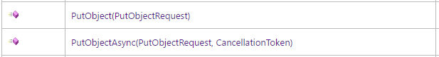

# 실버바인 서버엔진의 파이버
실버바인 서버엔진 2에서는 반드시 파이버를 통해서만 DB 접근을 할 수 있도록 만들었습니다.

그런데 실버바인 서버엔진 2의 파이버는 Lua처럼 언어에서 기본 지원하는 것이 아니라,  
'실행 종료를 기다릴 수 있는 async 루틴들' 을 잘 **연결해서** 하나의 실행 흐름으로 느껴지도록 만든 것입니다.  
 
async 루틴들을 연결하는 부분을 실수하면, 파이버 전환이 비정상적으로 일어나서, 엔진 내부의 Assert에 걸리게 됩니다. 그런데 Assert가 실수한 위치와 영 동떨어진 곳에서 발생하기 때문에, 뭘 잘못했는지 찾아내기가 매우 어렵습니다. 현재는 프로그래머가 파이버를 어떻게 써야 하는지 이해하고 주의깊게 작성하는 수밖에 없습니다.
 
파이버와 관련한 규칙을 몇 가지 설명하겠습니다.
 
## async void 금지
C# async 함수는 세 가지 종류의 리턴값 중 하나를 가질 수 있습니다.
1. async Task: 실행 완료를 기다릴 수 있고, 리턴값 없음
2. async Task&lt;T>: 실행 완료를 기다릴 수 있고, 리턴값 있음
3. async void: 실행 완료를 기다릴 수 없음
 
async void를 쓰면 파이버로 제대로 실행할 수 없습니다. 소스코드를 전체검색해서 async void가 하나라도 들어있다면 심각한 문제가 있는 것이라고 보셔도 됩니다.
 
## 리턴되는 Task를 무시하면 안됨
파이버를 구성할 async 루틴들이 리턴하는 Task를 무시하면, async void 함수를 호출했을 때와 비슷하게 엔진 내부의 Assert에 걸립니다. 리턴된 Task는 반드시 어디에선가 await되어야 합니다.
 
받은 Task를 그 자리에서 바로 await하거나, 아니면 바로 리턴함으로써 나를 호출한 함수가 그 Task를 기다릴 수 있도록 하세요.
 
## 세션핸들러에서는 null을 리턴해도 됨
ISessionHandler 보시면 모든 메서드에 Task가 달려 있지요.  
파이버 안에서 실행되는 친구들입니다.  
따라서 async Task로 만들어야 하는데요,  
세션핸들러에 대해서는 엔진에서 특수 처리를 해놓았기 때문에,  
리턴되는 Task가 null이면 await하지 않고 바로 진행하게 되어 있습니다.  
 
모바일 게임이라면 클라이언트가 보낸 모든 요청에서 DB에 접근해야 하니까 언제나 실행 중지/재개가 필요하지만,  
MMORPG라면 DB에 접근하는 요청보다는 메모리에서 처리가 끝나는 요청들이 더 많을 것입니다.  
그런 요청 하나하나마다 파이버를 중지/재개하는 비용이 걱정된다면 그냥 async 키워드를 떼고, Task에는 null을 리턴해도 됩니다.

## 파이버에서 다른 라이브러리의 ~Async 함수를 호출하면 안됨
중요하니까 궁서체로 한번 더 쓰겠습니다.

 
AWS SDK 같은 거 보면
 

 
이런 식으로 ~Async 함수가 함께 제공됩니다.
리턴값도 Task<T>니까 파이버랑 어울려 쓸 수 있을 것처럼 생겼지만
 
**아닙니다.**
 
실버바인 서버 엔진 2가 직접 제공하는 것을 제외하면
~Async 함수 근처에도 가시면 안됩니다.

그 이유는 이렇습니다.
 
[백그라운드 스레드를 파이버와 어울려 사용하기](doc/background_thread.md)에서
게임 로직 코드는 오직 메인 스레드에서만 돌린다고 말씀드렸지요.
 
위의 ~Async 함수를 실행하고 그 결과를 await하면,
await한 이후의 실행이 메인 스레드가 아니라 다른 스레드로 바뀌어 버립니다.
파이버는 메인 스레드에서만 실행 가능하므로, 에러가 발생하게 됩니다.
  
~Async 안 붙은 버전을 쓰시고,
[백그라운드 스레드를 파이버와 어울려 사용하기](doc/background_thread.md)를 참고하셔서
스레드풀에서 실행하도록 프로그래밍하셔야 합니다.