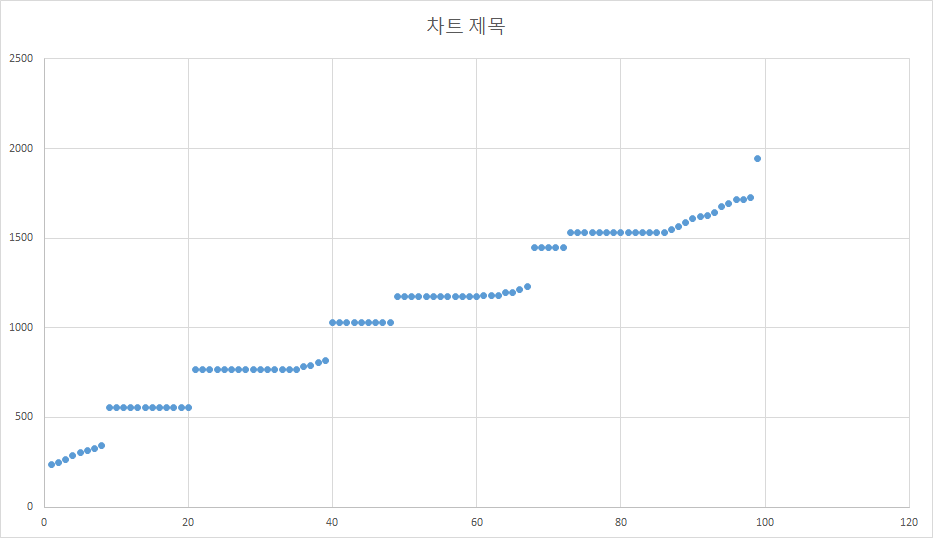

# 네트워크 지연시간 시뮬레이션

품질이 좋지 않은 실제 네트워크 환경을 모사하여 테스트할 수 있습니다.
기본 지연시간과 패킷 손실 확률을 지정하여 TCP의 head-of-line blocking 지연시간 패턴을 흉내내며,
클라이언트 → 서버, 서버 → 클라이언트의 회선 특성을 각각 지정할 수 있습니다.
 
모든 패킷은 기본 지연시간만큼 늦어져서 전달되며,
패킷 손실이 일어났다고 판정한 경우 그 패킷이 기본 지연시간만큼 추가로 늦어져서 전달됩니다.
그리고 후속 패킷은 늦어진 패킷 이후에 몰려서 도착하게 됩니다.
 
지연시간 200ms, 손실 확률 5%로 설정하고 실험한 예입니다.


 
## 클라이언트 → 서버 전송 레이턴시 시뮬레이션
서버의 로그인 프로세서에서 세션핸들러를 생성할 때, 아래와 같이 BeginSimulatingReceiveLatency 호출해서 세션핸들러를 감싸서 리턴합니다.
```
var actualHandler = new TestSessionHandler(param.SessionId);
return EngineAPI.Networking.BeginSimulatingReceiveLatency(actualHandler, TimeSpan.FromSeconds(0.2), 0.05);
```
두번째 인자가 `baseDelay`, 세번째 인자가 `lossRate`입니다.
리턴되는 객체의 프로퍼티를 조작해서 나중에도 `baseDelay`와 `lossRate`를 바꿀 수 있습니다.
 
## 서버 → 클라이언트 전송 레이턴시 시뮬레이션
서버의 세션이 생성되는 시점, 혹은 아무 때나 아래 엔진 API를 호출하십시오.
```
EngineAPI.Networking.BeginSimulatingSendLatency(sessionId, TimeSpan.FromSeconds(0.2), 0.05);
```
두번째 인자가 `baseDelay`, 세번째 인자가 `lossRate`입니다.
여러번 호출해서 `baseDelay`와 `lossRate`를 바꿀 수 있습니다.
 
## 공통
미리 `EngineAPI.Config.AllowLatencySimulation` 을 `true`로 설정해두어야 합니다.
 
`false`로 설정해두면 `new LatencySimulatingSessionHandlerFilter, BeginSimulatingSendLatency` 호출에서 에러가 발생하게 됩니다(의도입니다).
 
절대로 실제 서비스에서 이 플래그가 켜지는 일이 없도록 하십시오.
정상적으로 서비스가 가능한 성능이 나오지 않습니다.
 
그리고 `LatencySimulatingSessionHandlerFilter`는 세션핸들러와 별도의 파이버에서 돌기 때문에, 예상 못한 동작차이가 있을지도 모릅니다.
없을 거라고 예상합니다만 혹시 모르니…….
따라서 `LatencySimulatingSessionHandlerFilter` 를 상시 켜놓고 개발하시면 안됩니다.
나중에 필터 벗겼다가 동작 달라지면 트러블슈팅이 매우 괴로울 것입니다.
