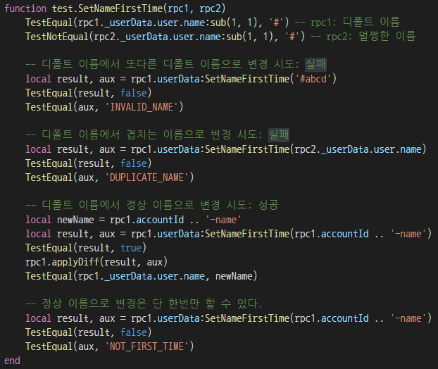

# 테스트 클라이언트 만들기

테스트 클라이언트는 두가지 용도로 만듭니다.
 
## 기능 테스트 클라이언트
서버를 테스트할 때마다 매번 클라이언트를 띄우려면 귀찮고 번거로우므로,
테스트 클라이언트를 만들기를 권합니다.
 
유닛 테스트와 비슷한 느낌으로, 서버의 핸들러를 호출하고, 서버가 보낸 응답을 확인해서, 기대하는 것과 다른 응답이 돌아왔다면 에러메시지를 출력하고 즉시 종료하도록 만들면 됩니다.

아래는 마비노기 듀얼에서 가져온 테스트 케이스로, 전체 3000라인쯤 되는 테스트 클라이언트의 일부입니다. SetNameFirstTime이라는 핸들러를 여러 가지 방법으로 테스트하는 걸 보실 수 있습니다.

이 예제는 루아로 되어있지만, 테스트 클라이언트를 꼭 루아로 작성해야 할 필요는 없습니다. 게임 클라이언트와 같은 언어로 만드는 것이 여러 모로 편할 것입니다.

주의할 점:
- TOY 로그인 등 정말 어쩔 수 없는 핸들러를 제외하면, 테스트 클라이언트가 모든 서버 핸들러를 최소 한 번 이상은 호출하도록 만들어야 합니다.
 
- 여러 테스트 클라이언트를 동시에 실행해도 서로 간섭하지 않도록 만드세요. 그러지 않으면 부하 테스트용으로 수정하는 작업을 할 때 크게 재작업해야 할 수 있습니다. 전체 테스트 시나리오를 실행할 때마다 계정을 새로 만들고 그 계정 안에서만 작업하도록 하는 것이 좋습니다.

- 전역 게임 서버 상태에 영향을 주거나 받는 테스트 케이스는 피하는 것이 좋습니다. 동시에 실행되는 테스트 시나리오들끼리 서로 격리가 되도록 하되, 만약 격리하기 어려울 경우 영향을 받는 쪽에서 조건을 크게 완화하는 식으로 대처해야 합니다. 그러지 않으면 여러 테스트 클라이언트가 동시에 동작할 때 테스트가 실패할 수 있습니다. 잘 재현되지 않는 문제이므로 매번 신경쓰기도 번거롭고, 장기적으로는 테스트 실패에 대해 사람들이 둔감해지게 됩니다.
 
## 부하 테스트 클라이언트
기능 테스트 클라이언트를 그대로 가져다가 부하 테스트에 쓰면 테스트 클라이언트 장비 한 대에서 충분히 많은 부하를 가할 수 없기 때문에, 약간 고쳐서 프로세스 하나에서 매우 많은 테스트 클라이언트를 동시에 돌릴 수 있도록 만들면 좋습니다.
 
실버바인 서버 엔진 2를 사용해서 C#으로 테스트 클라이언트를 만들고 있다면 다음과 같이 작업하시길 권장합니다.
 
 
다음과 같은 작업을 무한 반복하는 스레드를 CPU 개수 * 5 정도 스폰합니다(스레드끼리는 상호작용하지 않습니다):
1. 스레드가 가진 커넥션 큐에서 마지막으로 테스트 시나리오를 돌린 지 가장 시간이 많이 흐른 커넥션을 꺼냅니다. 이것을 C라고 합시다.
2. C가 생성된 지 `$(SessionDuration)`초 지났으면 커넥션을 폐기합니다.
3. C가 마지막으로 테스트 시나리오를 돌린 지 `$(TestExecutionInterval)`초 지나지 않았으면 C를 다시 풀로 되돌려보내고, 새 커넥션을 생성하고 이제부터 이것을 C라고 부릅시다.
4. C를 가지고 기능 테스트를 1회 실행합니다.
5. C를 풀에 되돌려보냅니다.
6. 풀에 있는 모든 커넥션들에 대해 PerformIO()를 1회씩 부릅니다.

 
`$(SessionDuration)`과 `$(TestExecutionInterval)`은 스튜디오나 회사 임직원을 대상으로 실시하는 소규모 테스트의 로그를 분석해서 결정하는 것이 좋습니다.

- `$(SessionDuration)`: 세션이 새로 생성된 뒤 게임을 종료하기까지 걸린 평균 시간입니다(또는 아무 대표값이나 괜찮음. 중간값이 있으면 그것도 괜찮음). 
※ 의도는 각 커넥션이 적어도 `$(SessionDuration)`만큼 세션을 붙잡게 하기 위함입니다.
 
- `$(TestExecutionInterval)`: 한 세션이 보내는 요청 사이의 평균 간격이 T초이고, 기능 테스트 한 번에 요청을 N개 보낼 때, `$(TestExecutionInterval)` 은 T * N 으로 정하면 됩니다.
